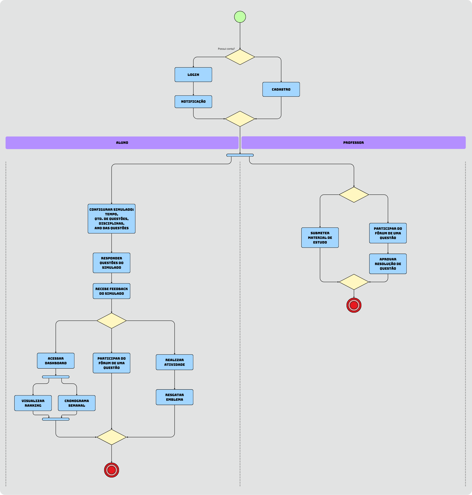

# Documento de Diagrama de Atividades - Plataforma de Resolução de Questões ENEM

## 1. Introdução

Este documento apresenta o diagrama de atividades para a plataforma de resolução de questões voltada ao ENEM. O modelo inclui uma representação visual do fluxo de atividades do sistema, incluindo ações, decisões, forks, joins e sincronizações, para mapear os processos e suas sequências.

## 2. Metodologia

Para a elaboração do diagrama de atividades, os integrantes do squad 2, [Ana Carolina](https://github.com/CarolCoCe), [Felipe Motta](https://github.com/M0tt1nh4), [João Artur](https://github.com/joao-artl), seu reuniram para construir o diagrama a partir da análise dos requisitos e do diagrama de classes, garantindo que o fluxo de atividades fosse descrito de forma alinhada às necessidades identificadas.

## 3. Diagrama de Atividades

O **diagrama de atividades** fornece uma visualização do comportamento de um sistema descrevendo a seqüência de ações em um processo. Os diagramas de atividades são semelhantes a fluxogramas porque mostram o fluxo entre as ações em uma atividade; no entanto, os diagramas de atividades também podem mostrar fluxos paralelos ou simultâneos e fluxos alternativos.

## 4. Diagrama

<figure markdown>

<b>Imagem 1</b> - Diagrama de Atividades

Fonte: [Ana Carolina](https://github.com/CarolCoCe), [Felipe Motta](https://github.com/M0tt1nh4), [João Artur](https://github.com/joao-artl)

</figure>

   
## 5. Análise e Conclusão

O diagrama de atividades feito possibilitou a equipe de analisar e visualizar o fluxo do sistema de modo mais claro e organizado, além de sanar possíveis dúvidas e mal-entendidos sobre o funcionamento do sistema. Como resultado, foi possível inclusive diferenciar o fluxo claramente entre o professor e o aluno, facilitando a compreensão do sistema como um todo.

## Referências Bibliográficas

> <a id="REF1" href="#anchor_1">1.</a> UNIVERSIDADE DE BRASÍLIA. Arquitetura e desenho de software – aula modelagem UML dinâmica. Profa. Milene. 

> <a id="REF2" href="#anchor_2">2.</a> IBM. 2021. Diagramas de Atividades. Disponível em: https://www.ibm.com/docs/pt-br/rational-soft-arch/9.7.0?topic=diagrams-activity. Acesso em: 28/11/2024.

## Histórico de Versão

| Versão | Data | Data de Revisão | Descrição | Autor(es) | Revisor(es) | Detalhes da revisão |
| ------ | ---- | --------------- | --------- | --------- | ----------- | ------------------- |
| 1.0 | 28/11/2024 | 28/11/2024 | Criação do documento | [Felipe Motta](https://github.com/M0tt1nh4) |  |  |
